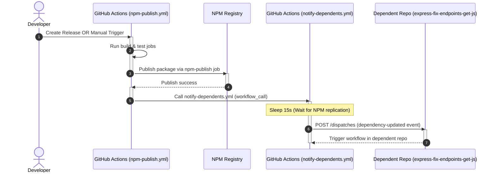

# The Release and Dependency Notification Story

This document tells the story of how our package release and dependency notification workflow is structured. 

We split the logic into two separate, modular workflow files:
1. **[npm-publish.yml](file:///d:/KeshavSoftRepos/6aug-1/express-fix-any-js/.github/workflows/npm-publish.yml)**: The **Caller Workflow** that builds, tests, and publishes the package.
2. **[notify.yml](file:///d:/KeshavSoftRepos/6aug-1/express-fix-any-js/.github/workflows/notify.yml)**: The **Callee Workflow** that handles post-publish notifications.

---

## High-Level Sequence

Here is the step-by-step lifecycle of a release:

---

## Detailed Step Description

### Step 1: Trigger (Release Created or Manual Dispatch)
The story begins when either a new release is created on GitHub, or the workflow is triggered manually (using the **"Run workflow"** button in the GitHub Actions tab). Either event triggers the caller workflow: [npm-publish.yml](file:///d:/KeshavSoftRepos/2026-06-28/express-fix-any-js/.github/workflows/npm-publish.yml).

### Step 2: Build & Test
The `build` job runs on `ubuntu-latest`. It sets up Node.js (version 20), installs dependencies via `npm ci`, and verifies that the package build is correct.

### Step 3: Publish to NPM
Once the build job succeeds, the `publish-npm` job executes:
- It logs into the NPM registry using the secret `NPM_TOKEN`.
- It publishes the updated package version using `npm publish`.

### Step 4: Call Notification Workflow
Upon successful publication, the caller workflow uses GitHub's `workflow_call` mechanism to invoke [notify.yml](file:///d:/KeshavSoftRepos/6aug-1/express-fix-any-js/.github/workflows/notify.yml). It forwards the required secret `REPO_DISPATCH_TOKEN` so that the callee workflow can authorize itself.

### Step 5: Registry Replication Delay
Because NPM registries can take a few seconds to replicate metadata globally, the callee workflow pauses for **15 seconds** (`sleep 15`). This ensures that when dependent projects trigger their build, the newly published package version is available for installation.

### Step 6: Dispatch Webhook to Dependents
Finally, a `curl` POST request is sent to the GitHub API repository dispatches endpoint for `express-fix-endpoints-get-js`. This triggers its automatic update workflow to fetch our latest version.
